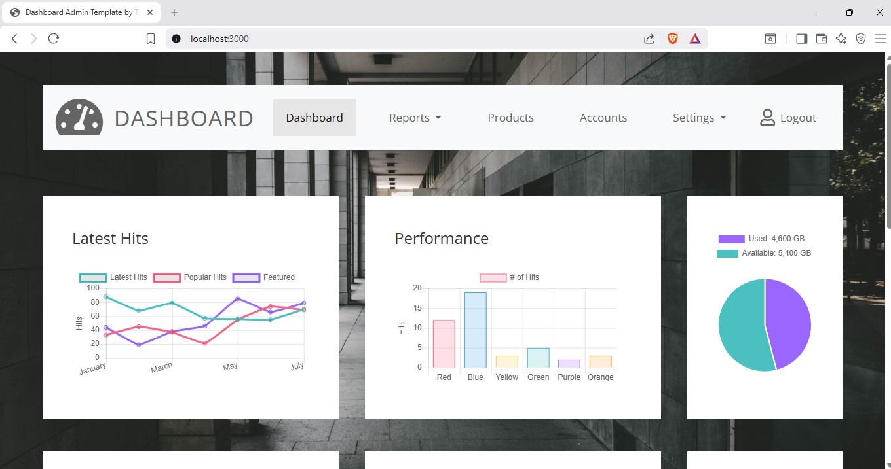
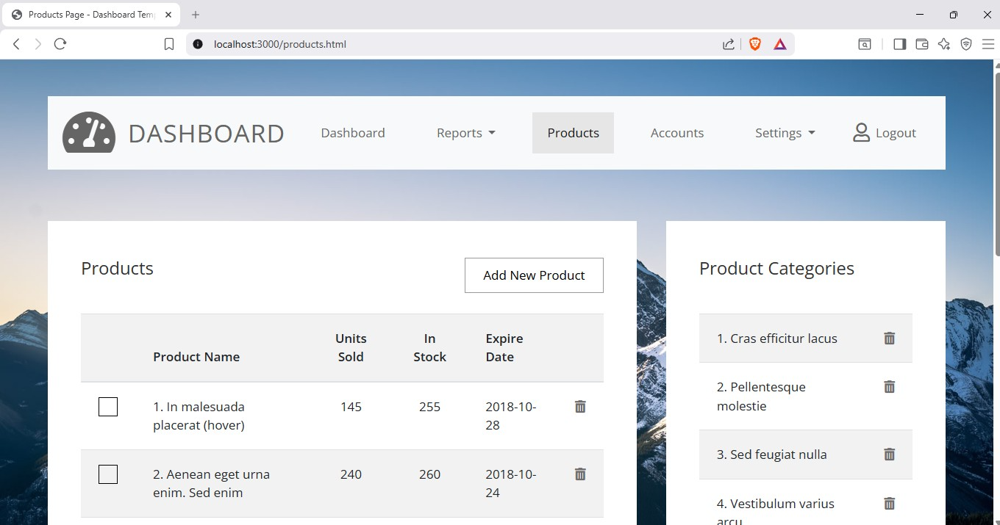

🚀 Production-Grade DevSecOps Pipeline for Node.js Dashboard (AWS EC2)
======================================================================

This project demonstrates a **production-style DevSecOps pipeline** that automates testing, security scanning, containerization, and deployment of a Node.js application to AWS EC2.

It integrates:

-   **Code quality enforcement**
-   **Security scanning (dependencies + containers)**
-   **Containerization**
-   **Automated deployment to AWS EC2**

Built to reflect **real-world DevOps best practices** used in industry.


* * * *

🧠 Architecture
---------------

```

GitHub Push
    ↓
GitHub Actions Pipeline
    ↓
Lint → Test → SonarQube → Snyk → Docker Build → Trivy
    ↓
Secure Deploy to AWS EC2 (SSH)
    ↓
PM2 Process Manager
    ↓
Nginx
    ↓
Live Application

```

🔄 CI/CD Workflow
-----------------

### 🔹 Trigger Events

-   Push to `main`
-   Pull Requests to `main`

### 🔹 CI Stage (Quality + Security)

| Step | Tool | Purpose |
| --- |  --- |  --- |
| ✅ Install | npm | Dependency installation |
| ✅ Lint | ESLint | Code quality |
| ✅ Test | Jest/Mocha | Unit testing |
| 🔍 Scan | SonarQube | Static analysis |
| 🔐 Scan | Snyk | Dependency vulnerabilities |
| 🐳 Build | Docker | Containerization |
| 🛡️ Scan | Trivy | Image vulnerabilities |

🚨 Pipeline fails if:

-   Tests fail
-   Lint fails
-   Critical vulnerabilities are detected

### 🔹 CD Stage (Deployment)

Runs **only on successful CI + push to main**

#### Deployment Flow:

```

SSH → Sync Files → Install Dependencies → PM2 Restart → Nginx Setup

```

🛠️ Tech Stack
--------------

| Category | Tools |
| CI/CD | GitHub Actions |
| Backend | Node.js |
| Security | Snyk, Trivy |
| Code Quality | SonarQube |
| Containerization | Docker |
| Cloud | AWS EC2 |
| Process Manager | PM2 |
| Web Server | Nginx |

🔐 Security Layer (Key Highlight)
---------------------------------

This pipeline integrates **multi-layer security**:

-   🔎 **Snyk** → scans dependencies
-   🐳 **Trivy** → scans Docker images
-   📊 **SonarQube** → detects code vulnerabilities

🌐 Deployment Details
---------------------

### Nginx Reverse Proxy

```

server {
    listen 80;
    server\_name \_;
    location / {
        proxy\_pass http://127.0.0.1:3000;
    }
}

```

### PM2 Process Management

```

pm2 start server.js \--name dashboard-app
pm2 save

```

🔑 Required GitHub Secrets
--------------------------

| Secret | Description |
| `SONAR_TOKEN` | SonarQube token |
| --- |  --- |
| `SNYK_TOKEN` | Snyk token |
| `EC2_SSH_KEY` | SSH private key |
| `EC2_HOST` | EC2 public IP |
| `EC2_USER` | EC2 username |


📸 Preview




🚀 Live Demo
👉 http://<YOUR-EC2-PUBLIC-IP>:80

▶️ Run Locally
--------------

```

npm install
node server.js

```
📈 Why This Project Stands Out
------------------------------

✔️ End-to-end CI/CD pipeline
✔️ Integrated DevSecOps practices
✔️ Production deployment on AWS
✔️ Real-world architecture
✔️ Automated security enforcement

🧪 Future Improvements
----------------------

-   Kubernetes deployment (EKS)
-   Blue/Green deployment strategy
-   Monitoring (Prometheus + Grafana)
-   HTTPS with Let's Encrypt
-   Auto-scaling

👤 Author
---------

**Mark Fosu**
DevOps | Cloud | DevSecOps | AWS, Kubernetes, Terraform, CI/CD | Site Reliability & Cloud Infrastructure